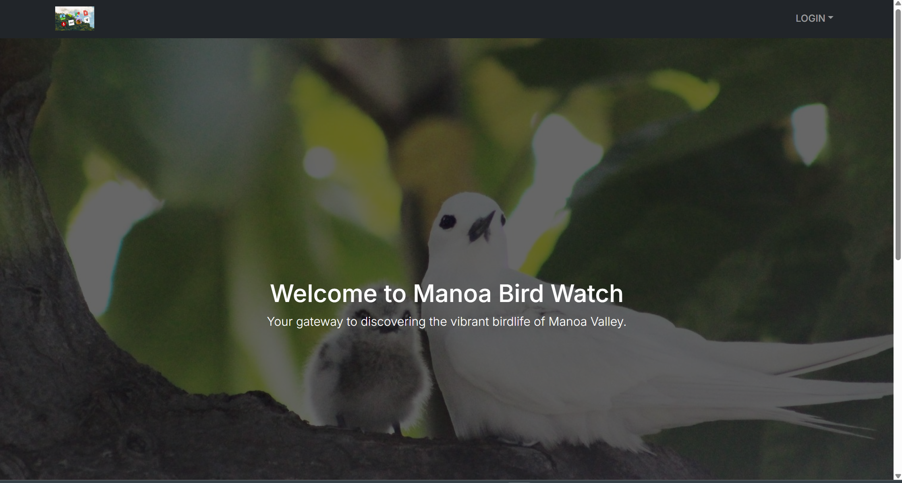
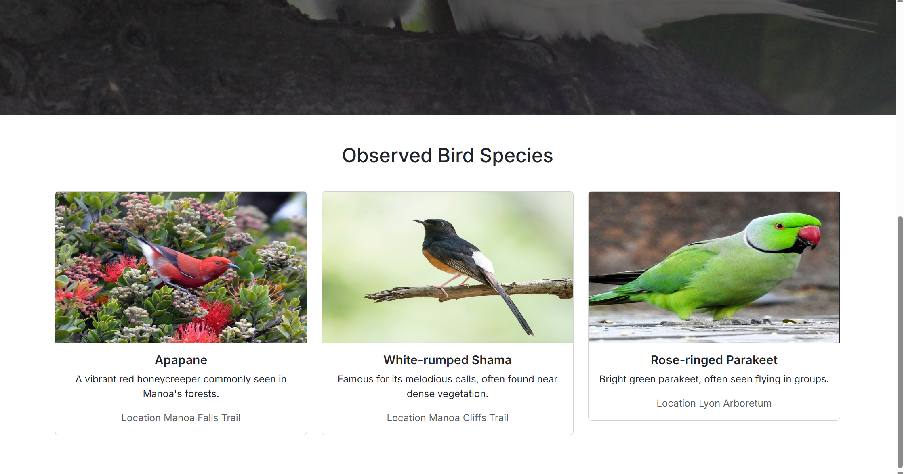

Software Engineering Project 2025 (ICS 314)

Project Title: Manoa Bird Watch

Our Github Organization and Repositories  
<https://github.com/orgs/manoa-bird-watch/repositories>  

Team Contract  
<https://github.com/manoa-bird-watch/manoa-bird-watch.github.io/blob/issue-09/teamcontract.md>

Members
- [Ace Reyes](https://github.com/Acezorey)
- [Alana Wesly](https://github.com/awesly)
- [Jeffrey Jian](https://github.com/jeffrey8193)
- [Chayanika Devi](https://github.com/Chayanika-Devi)

## Table of contents
1. [Overview](#overview)
2. [User Guide](#user-guide)
3. [Developer Guide](#developer-guide)
4. [Deployment](#deployment)
5. [Design Plan](design-plan)
6. [Project Proposal](#project-proposal)
7. [Approach](#approach)
8. [Features](#features)
9. [Use Case Ideas](#use-case-ideas)
10. [Beyond the Basics](#beyond-the-basics)

## Overview

_The problem:_ The Manoa campus is home to a diverse collection of plant and animal species, including many native to Hawaii. As a result, there are many avid bird watchers and people interested in where to find bird species, what time of day can you see these birds, and what bird species are you actually looking at. How can you find the bird you are looking for on campus reliably?

_The solution:_ Design a website to collect a list of birds and various information about them such as spotted locations, species and name, and what time of day and what part of the year can you spot them. Users can login and post information about where the birds have been spotted to better aid other bird watchers in finding them. 

## User Guide 

The Birds of Manoa website experience starts with a home page. On the home page, users can see an introduction to the website, and if they scroll down, a couple of currently featured bird species that can be seen in Manoa. If a user is not yet signed in, the navbar gives users the options "ALL BIRDS" to go to that page or the "LOGIN" dropdown, where users can select sign in or sign up, and go to the corresponding page.
    (UPDATE HOME PAGE SC W CURRENT NAVBAR)   



ALL BIRDS takes all users to Birds of Manoa, a page that displays all of the birds that may reasonably be seen in the Manoa area. It has a card for each bird with their picture, common name, olelo Hawai name if they have one, their scientific name, and a description of them.
     (ADD birds of manoa page)

At the sign up and sign in pages, users can either create a new account and then be signed in to it, or sign in to an account they previously made. Having an account is important because it allows the user to add their own bird sightings on the report sighting page, and see their past sightings on the list sightings page. Once signed in, users will see the "REPORT SIGHTING" and "LIST SIGHTING" options available to them in the navbar.    
   

     (ADD updated navbar once signed in)

In the report sightings page, users can add a new sighting of a bird in Manoa! It features ____ . The list sightings page then updates to show all of the sightings that the signed in user has made. 
      (ADD report sightings page)
      (ADD list sightings page)

For all users, signed in or not, the "ALL SIGHTINGS" navbar option will take them to the All Sightings page, that displays all bird sightings that have been reported, from all signed in users. 
      (ADD all sightings page)


## Developer Guide

### Prerequisites:

You must have [PostgreSQL](https://www.postgresql.org/download/) installed on to your system first in order to enable database functionality. ***Remember and/or record the username and password that you set for your database during installation***.

Installing [VSCode](https://code.visualstudio.com/download) and [Github Desktop](https://desktop.github.com/download/), although not necessary, will make development using this code much easier.

### Installation and Execution:

(Note that the following commands may take up to a few minutes to fully execute)

Create a database for this web app by entering in the following command in a cmd line window:

```
createdb manoa-bird-watch-db
```

 Navigate to the [Manoa Bird Watch App repository](https://github.com/manoa-bird-watch/manoa-bird-watch-app) and either click the green "Code" button to download and extract the zip file to your file system, or click the "fork" button to fork the repository to make your own copy, then either download and extract again or use Github Desktop to clone the forked repo to your system.

Next, cd (or if using VSCode, open a terminal) into your local directory containing the repo code, and install all third party libraries using:

```
npm install
```

Then, create a new .env file, copying the information within the sample.env file, and change the "user" and "password" substrings of the DATABASE_URL field to what you have set it to when you installed PostgreSQL.

Run the following commands to initialize the PostgreSQL tables and to seed the database with the necessary bird information:

```
npx prisma migrate dev
```

```
npx prisma db seed
```

Once everything has been installed and the database has been initialized and seeded, you can then run the program by invoking the command:
```
npm run dev
```

Your resulting version of the Manoa Bird Watch app can then be accessed through localhost:3000 on your web browser, or through whichever hostname next.js assigns to your run.
## Deployment

Here is the deployed application:
<https://m1-git-main-jeffrey8193s-projects.vercel.app/>

Projects and their issues can be seen here:  
[Code repo](https://github.com/manoa-bird-watch/M1)  
[M1 issues board](https://github.com/orgs/manoa-bird-watch/projects/1/views/1?layout=board)  
[M2 issues board](https://github.com/orgs/manoa-bird-watch/projects/4/views/1)  
[M3 issues board](https://github.com/orgs/manoa-bird-watch/projects/5/views/1?system_template=team_planning)  

## Design Plan 

For M1:
- create mockups of each page 
- deploy the nextjs application template
- create the color blocked landing page 
- create the sign in / register page, which is linked in the navbar of the landing page
- create M2 project and add issues to it

For M2:
- update the schema prisma for better funcitonality and add bird data
- add four more pages:
  - birds of manoa page
  - report sightings page
  - list your sightings page
  - list all sightings page
- add user guide and developer guide to home page with updated screenshots of the pages

For M3:
- thoroughly test the website with our own login information and bird sightings
- thoroughly test the website with at least 5 UHM volunteers using it
- "implement acceptance testing"
- update homepage with current status of the website and "community feedback" section

## Project Proposal


## Approach

Users can create an account and update information about a bird species. Each bird species will have profile listing information about their name/species, location on campus, description, and the time of day and time of year they can be spotted on campus. Users can add information in the form of bird sightings, including location and date of the sighting. 

## Features

Our current idea is for this project to make use of 4 distinct pages: a main landing page displaying cards containing the information of different observed bird species, a login page where users can register and sign in, a “report sighting” page where users can add the birds that they have seen and the information they have of them (image, description, location etc…) to a database, and a “list sightings” page where users can see all of the birds they have seen previously, as well as add, delete, or edit past bird sightings.

Or, more simply:
- Landing page with all the birds
- User login page
- Report sighting page
- List sightings page

## Use case ideas

There are many possible use cases for this website. An initial one is, a new user going to the landing page, which is the home page, and making a new user account. Another use case is a returning user going to the landing page, which goes to the home page, signing in with their account, and navigating to the report sighting page to add information about a bird they have seen. Additionally, any user, with or without signing in, can browse the list of birds on the landing page, and a signed in user can navigate to the list sightings page and view and edit their past sightings. 

## Beyond the Basics

- Create a map that can be filtered by bird species. The map should show the bird species name, origin of the species whether it is migratory or Hawaiian bird once you click on the spotted location. 
- Add bird calls to each species
- A tracker displaying a user’s streak of how many days in a row they have reported a bird sighting, and a graph showing their rate of birds sighted over time.
